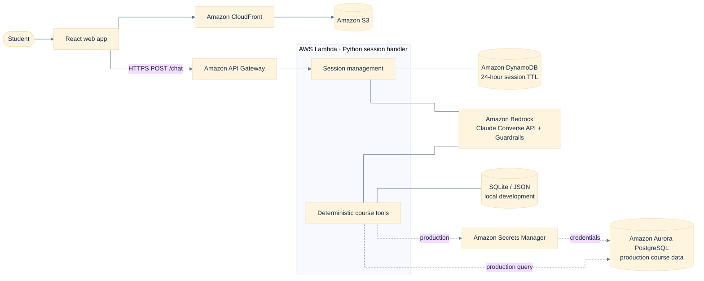

# CVC Chatbot — Architecture Guide

## Service map

## How to explain the request flow

1. The browser loads the React app through **CloudFront**, which serves static files from **S3**.
2. The browser sends a chat message to **API Gateway** over HTTPS.
3. API Gateway invokes a Python **Lambda** function. Lambda restores short-lived conversation context from **DynamoDB**.
4. Lambda calls **Amazon Bedrock** through the Converse API. Guardrails limit the assistant to CVC course-advising topics.
5. When Bedrock requests a tool, Lambda runs deterministic Python code to filter and rank course data. This keeps course facts outside the model and testable.
6. Lambda returns the final reply and structured course cards through API Gateway to the React app.

## Data-path nuance

- **Local development:** SQLite and JSON course data make development and tests credential-free.
- **Production target:** Lambda obtains database credentials from **Secrets Manager** and queries **Aurora PostgreSQL**. Aurora should be private in a VPC and reachable only by approved workloads.

## Thirty-second architecture summary

“The application is a serverless React and AWS architecture. CloudFront and S3 deliver the frontend, API Gateway receives chat requests, and Lambda orchestrates the conversation. Lambda stores only short-lived session state in DynamoDB, calls Bedrock for natural-language understanding and guarded response generation, and executes deterministic course-search tools for the actual filtering and ranking. That separation means the model handles language while application code remains the authority for course data. In production, Aurora stores course data and Secrets Manager supplies credentials.”

## Key design decisions to emphasize

- **Serverless scaling:** API Gateway, Lambda, DynamoDB, and Bedrock reduce infrastructure management and scale with demand.
- **Grounding:** Bedrock does not act as the database; deterministic tools return structured course results.
- **Privacy:** Sessions use an opaque ID and a 24-hour DynamoDB TTL rather than persistent user accounts.
- **Security:** HTTPS at the edge, IAM least privilege, Bedrock Guardrails, Secrets Manager, and a private production database boundary.
