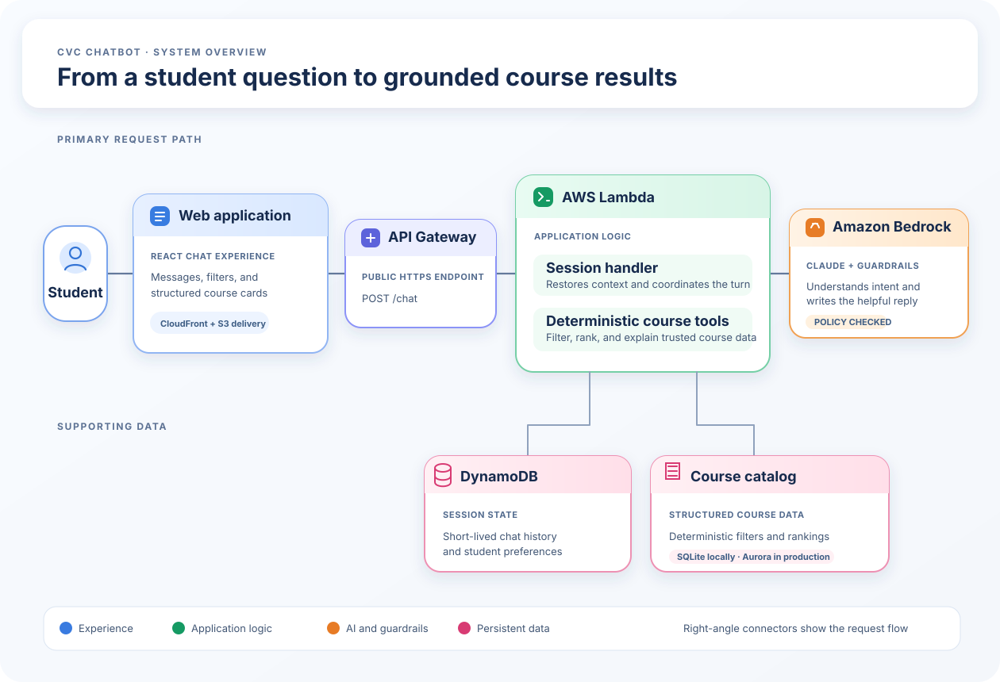

# CVC Chatbot — System Architecture

This is the high-level request path for the CVC conversational course-discovery application. The model understands the student's request; application code performs the course lookup and returns structured results.

## What each part does

| Key player | Responsibility |
| --- | --- |
| **React + CloudFront/S3** | Displays the chat and course cards, and serves the static web application. |
| **API Gateway** | Public HTTPS entry point for chat requests. |
| **Lambda** | Restores session context, calls Bedrock, runs the approved tools, and shapes the response. |
| **Amazon Bedrock** | Understands natural-language requests, applies guardrails, and decides when a tool is needed. |
| **Course tools + catalog** | Keep filtering, ranking, and course facts deterministic rather than model-generated. |
| **DynamoDB** | Holds short-lived conversation context behind a session ID. |

## Request in five steps

1. A student sends a question through the React chat interface.
2. API Gateway forwards it to the Lambda session handler.
3. Lambda loads the short-lived session and asks Bedrock to interpret the request.
4. If course information is needed, Lambda runs deterministic tools against the course catalog and returns those results to Bedrock.
5. Lambda returns Bedrock's concise reply and the structured course cards to the browser.

The SVG uses intentional right-angle connector paths, generous spacing, and card-style service representations to keep the flow readable at a glance.
